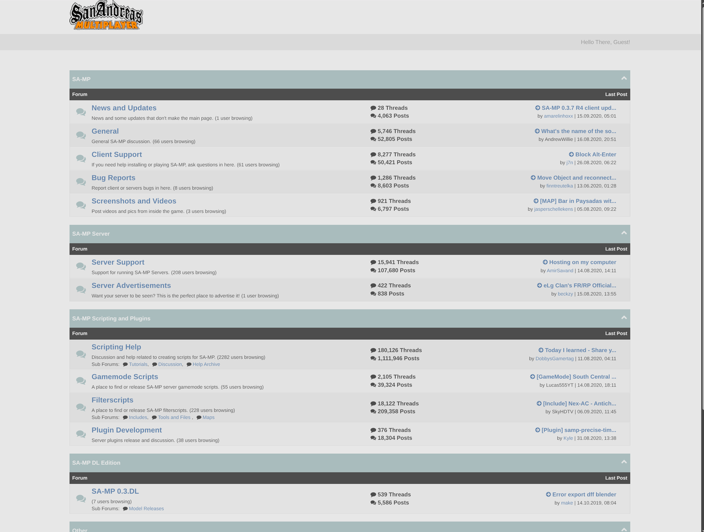

# SA-MP Forums Archive

This is a full crawl of the SA-MP forum archive. While the current mirror serves its purpose, because it's hosted in Russia it's inaccessible for some players, including myself.

I crawled this about a month or two ago when I had a spare VPS laying around and now that it's gathering dust on my hard drive I decided to release it. All content originally belongs to the now offline SA-MP forums which was mirrored by Blasthack.

There are 324,528 threads, 2,011,000 posts, 47,220 users and 9,369 avatars preserved, across all 41 forums.

## Important

This repository preserves all threads, member profiles, forum listings, and most internal links. Heavily computed pages such as searches (including find all posts by user) are not included. I did start work on the 'view all threads' per member though, which should work just fine, but never really finished it, so beware.

Only members that made a post got mined, the accounts with 0 posts sadly did not come with. Some forum listing pages had to be reconstructed from mined threads because the mirror became unstable during the crawl. They are sorted the same way.

Most avatars are mirrored in the repository but any images, links or videos naturally depend on their respective third party counterparts so they might be lost to the ages.

## Offline Browsing

Clone the repository and open `index.html`. Everything links locally so it will work just fine offline without needing to host it. You can just open it in a code editor like VSCode and CTRL+SHIFT+F to quickly browse or search for specific snippets or posts.
